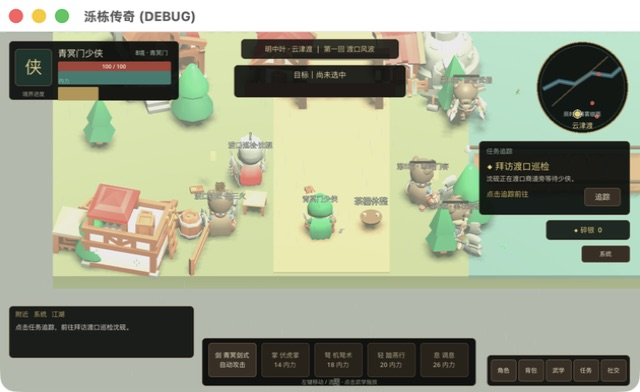
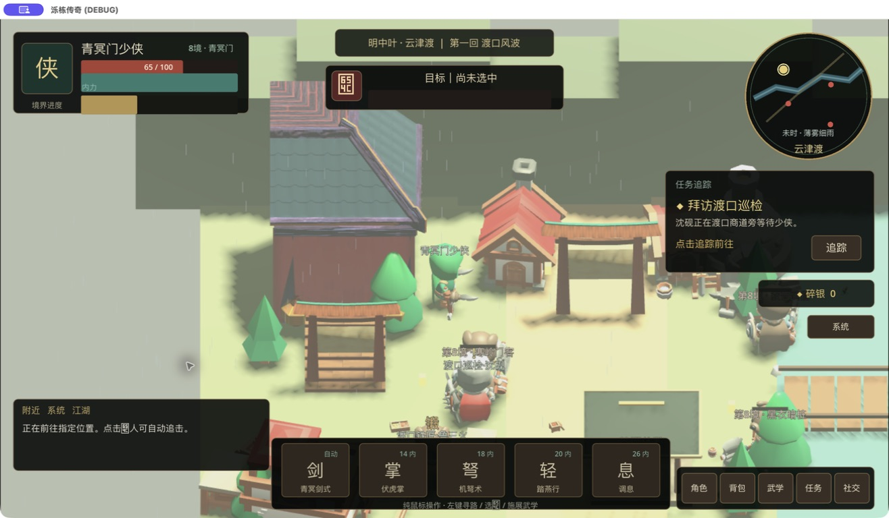
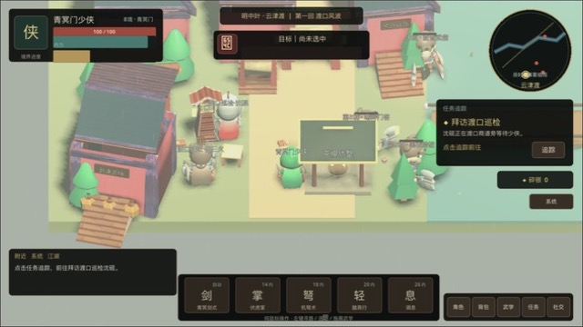

# 泺栋传奇

《泺栋传奇》是一款明中叶架空背景的 Windows 单机武侠 ARPG。当前 `main`
开发版采用 Godot 4.7.1 .NET，使用正交斜俯视构成 2.5D 网游观感，并以
真实 3D 场景、角色、导航、灯光和特效运行。当前已经具备实时 3D 云津渡、纯鼠标寻路、敌人 AI、
武学战斗、有关节武侠角色动画、昼夜与细雨环境、NPC 任务、掉落拾取、
背包装备、铁匠淬炼、两路线序章、连续敌人波次、等级与声望成长、存档和网游式 HUD。
云津渡新增红柱、石台、明式歇山顶构成的临水茶亭，并从 Polygonal Mind
CC0 GLB 仓库移植了真实东亚建筑模块。临河客栈现由青瓦屋顶、红墙、朱柱、
额枋、石阶、灯笼和木牌坊组成，不再使用通用欧洲酒馆模型。

## Windows 游玩

从 GitHub Releases 下载 `LuodongLegendary-0.9.0-win-x64-setup.exe`。安装向导采用 LZMA2 压缩，玩家可以修改安装目录，也可以选择是否创建桌面快捷方式。游戏仍然不需要联网。

游戏采用纯鼠标操作：点击地面移动，点击敌人后自动接近并攻击，点击 NPC
交谈，点击掉落物自动前往拾取，底部武学和右下角功能入口均可直接点击。
鼠标滚轮可以缩放等距镜头；NPC、敌人和茶棚设施均在 3D 世界中提供悬停、
头顶标识和进入交互距离后的反馈。云津渡现已移植 KayKit CC0 模块化村镇
和骨骼角色资产，程序化方块只保留为缺失资源时的安全回退。
序章可以选择优先护送百姓或追查证据，两条路线提供不同奖励，并共同导向
寒岭追兵战和第一件自动换装的进阶兵器。

云津渡的铁匠鲁三火可将当前兵刃稳定淬炼至 `+5`。每级淬炼消耗递增数量
的寒铁与碎银，并永久增加 2 点外功攻击；强化等级、材料和属性都会写入
离线存档。背包与角色面板会同步显示装备的 `+N` 等级。

`v0.8.0` 继续清理通用欧洲轮廓：鲁氏铁铺与云津货栈已经改用 Polygonal
Mind CC0 的青瓦、红墙、朱柱、木梁与石阶模块，并增加中文匾额、灯笼和
发光锻炉。青冥剑式、伏虎掌和敌人反击采用从 MIT Trail3D 技术重构的
相机朝向弧形刀光；机弩术保留直线曳光，使近战与远程反馈更易区分。

`v0.9.0` 将玩家、NPC 与敌人从 KayKit 卡通小人切换到
`Cats-Godot4-Modular-Souls-like-Template` 的公版成熟比例人形骨骼，并
接入 121 套共享动作。角色现在具备待机、行走、奔跑、挥砍、受击和倒地
动作；骨骼上新增原创交领长衫、下裳、腰带、广袖与右手佩刀组合，形成
后续替换高精度明代服装时可复用的换装底座。







完成云津渡序章后可进入独立的“寂音禅院”副本地图。副本包含巡逻守卫、
可造成伤害的踏板暗弩、可点击的机关总闸、商客营救、院主首领战，以及
交付罪证、宽宥悔悟者或带走赃银三种结局。

禅院守卫会显示黄色警戒视野锥；进入视野后视野锥转红并触发追击。玩家既可
正面击败守卫，也可绕行至机关总闸完成无声潜入。寂音院主拥有三个血量阶段，
会释放带地面预警的“震钟劲”，需要使用纯鼠标走位离开范围。

战斗采用鼠标技能栏：锁定敌人后青冥剑式持续自动攻击；点击伏虎掌或机弩术
会排队施放并自动进入有效射程。技能拥有独立内力消耗和冷却，技能按钮实时
显示内力消耗、纵向冷却遮罩与剩余秒数；锁定目标后显示网游式目标框，
自动接近时显示候招条，首领蓄力时显示危险施法条。伏虎掌命中院主时还能
延缓“震钟劲”的蓄力。

## 本地开发

主客户端需要 Godot 4.7.1 .NET 版本和 .NET 8 SDK：

```bash
godot --path godot --editor
```

导出 Windows x64 客户端：

```bash
godot --headless --path godot --export-release "Windows Desktop" \
  build/windows/LuodongLegendary.exe
```

Windows 安装包通过 `installer/luodong-legendary.iss` 使用 Inno Setup 6 生成。

## 开源技术迁移

当前 Godot 客户端的 3D 云津渡场景、角色、鼠标操作和战斗逻辑均为原创。
网游式 HUD 的组件职责借鉴了 MIT 项目 `Relintai/broken_seals`，但没有复制
其素材、世界观或界面皮肤。
东亚客栈、牌坊与灯阁使用 Polygonal Mind CC0 GLB 模型进行原创组合，固定
来源、提交和文件清单见 [THIRD_PARTY_NOTICES.md](THIRD_PARTY_NOTICES.md)。
旧 Phaser 原型曾迁移 `remarkablegames/phaser-rpg` 的 MIT 示例素材，固定来源和许可见
[THIRD_PARTY_NOTICES.md](THIRD_PARTY_NOTICES.md)。

本项目没有使用 Mir 系列的名称、地图、数据库、协议编号、角色、物品、怪物或素材。
《泺栋传奇》的明朝武侠世界、剧情内容、数值、3D 场景与界面均为原创。

## 文档

- [产品需求](docs/PRD.md)
- [剧情与产品方向](docs/PRODUCT_DIRECTION.md)
- [技术架构](docs/ARCHITECTURE.md)
- [开发说明](docs/DEVELOPMENT.md)
- [等距 3D 技术移植记录](docs/ISOMETRIC_3D_PORT.md)
- [东亚建筑资产移植记录](docs/EAST_ASIAN_ASSET_PORT.md)
