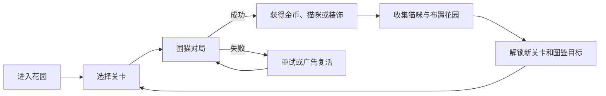

# 《猫猫不许跑》产品需求文档

> 文档版本：v0.1
> 项目代号：CatDontRun
> 产品形态：微信小游戏
> 开发模式：个人开发
> 当前阶段：MVP 立项

## 1. 文档目的

本文档用于统一《猫猫不许跑》的产品目标、业务需求、玩法规则、技术方案、开源项目使用边界、开发范围和验收标准，作为原型开发、素材制作、测试及上线准备的依据。

## 2. 产品概述

### 2.1 一句话介绍

《猫猫不许跑》是一款“围猫益智 + 猫咪收集 + 轻花园装修”的竖屏微信小游戏。玩家通过在棋盘上放置障碍，阻止猫咪逃到边界；成功围住猫咪后，可将其收养并安置在自己的花园中。

### 2.2 产品定位

- 核心体验：规则简单、单局短、失败后愿意立刻再来一局。
- 情绪价值：猫咪可爱、收集有惊喜、花园逐渐变丰富。
- 使用场景：微信内碎片时间游玩，单局约 1～3 分钟。
- 目标平台：首发微信小游戏，后续视数据考虑抖音小游戏及 Web 版本。
- 商业模式：MVP 以激励广告为主，不设计强制付费点。

### 2.3 目标用户

- 喜欢猫咪、治愈画风和轻收集的用户。
- 喜欢围堵、路径判断、一步一回合等轻策略玩法的用户。
- 每次游戏时间较短，但愿意通过每日任务持续收集的微信用户。
- 核心年龄预期为 18～40 岁，兼顾更广泛的休闲用户。

### 2.4 核心差异化

传统“围住小猫”玩法通常在成功或失败后直接结束。本项目增加三层长期目标：

1. 围住不同性格和能力的猫咪。
2. 完成猫咪图鉴和亲密度培养。
3. 使用游戏奖励装饰个人猫咪花园。

核心益智玩法负责即时乐趣，收集与装修负责长期留存。

## 3. 产品目标与非目标

### 3.1 MVP 目标

- 玩家在首次进入后 30 秒内理解规则并完成第一次有效操作。
- 核心棋盘玩法具备稳定的胜负判定和可调难度。
- 完成“闯关—获得猫咪/资源—返回花园—继续闯关”的完整循环。
- 至少提供 30 个可游玩关卡、6 只可收集猫咪和一套基础花园。
- 接入微信登录、云存档和激励广告的可替换适配层。
- 在主流微信小游戏运行环境中稳定运行，无阻塞流程的严重缺陷。

### 3.2 当前非目标

以下内容不进入首个 MVP：

- 实时多人对战。
- 公会、聊天和复杂好友关系。
- 自由摆放式大型装修编辑器。
- 大规模剧情和配音。
- 复杂付费商城、抽卡和会员系统。
- 自建重型游戏服务器。

## 4. 核心玩法设计

### 4.1 基础规则

- 棋盘采用六方向连接的蜂窝格，默认尺寸为 9×9，可按关卡调整。
- 猫咪出生在棋盘中心区域，部分格子预先放置障碍。
- 玩家每回合点击一个空格放置障碍。
- 玩家操作后，猫咪自动移动一格。
- 猫咪抵达任意边界格时，玩家失败。
- 当猫咪没有可移动路径时，玩家成功。
- 不允许在猫咪所在格或已有障碍格重复放置。

### 4.2 猫咪移动逻辑

MVP 使用确定性、可测试的最短路径策略：

1. 计算猫咪当前位置到所有可达边界格的最短路径。
2. 优先选择最短路径的下一格。
3. 存在多条等长路径时，从候选格中按关卡随机种子选择，保证同一关卡可复现。
4. 无可达边界时判定围堵成功。

后续可以增加不同性格的移动偏好，但不得通过纯随机制造无法预判的失败。

### 4.3 关卡难度参数

- 棋盘尺寸。
- 初始障碍数量与分布。
- 猫咪出生位置。
- 猫咪特殊能力。
- 玩家可用道具数量。
- 通关目标或限定步数。

### 4.4 猫咪能力

MVP 建议提供 6 只猫，每只猫对应一种轻量机制：

| 猫咪 | 特征 | 玩法能力 |
| --- | --- | --- |
| 橘猫 | 新手猫 | 无特殊能力 |
| 奶牛猫 | 活泼 | 首回合额外移动一次 |
| 布偶猫 | 谨慎 | 更倾向选择障碍较少的路线 |
| 黑猫 | 神秘 | 每局一次隐藏下一步方向 |
| 三花猫 | 聪明 | 等长路线中优先选择出口更多的格子 |
| 白猫 | 灵巧 | 每局一次跨过单个障碍 |

MVP 如开发时间不足，可先上线前三只，其余通过版本更新补充。

### 4.5 道具

- 提示：显示猫咪当前最可能选择的下一步。
- 撤回：撤回玩家上一步和猫咪对应移动。
- 毛线球：让猫咪本回合停留原地。

道具可通过关卡奖励、每日任务或激励广告获得。MVP 不出售影响胜负的付费道具。

## 5. 核心业务循环



### 5.1 短循环

放置障碍 → 观察猫咪移动 → 调整围堵策略 → 成功或失败。

### 5.2 中循环

完成关卡 → 获得金币和猫咪好感资源 → 解锁猫咪、道具或装饰。

### 5.3 长循环

完成章节 → 扩建花园 → 补全猫咪图鉴 → 参与后续活动和限定收集。

## 6. 功能需求

### 6.1 优先级定义

- P0：MVP 上线必需。
- P1：显著改善留存，首个迭代完成。
- P2：数据验证后再开发。

### 6.2 功能清单

| 模块 | 需求 | 优先级 |
| --- | --- | --- |
| 启动 | 加载页、版本检测、资源初始化、异常重试 | P0 |
| 新手引导 | 三步内教会放置障碍、胜利和失败条件 | P0 |
| 棋盘 | 蜂窝格生成、点击反馈、障碍放置 | P0 |
| 猫咪 AI | 最短路径、移动动画、胜负判定 | P0 |
| 关卡 | 关卡选择、解锁条件、星级或成绩记录 | P0 |
| 结算 | 成功/失败界面、奖励、重试、下一关 | P0 |
| 收集 | 猫咪解锁、图鉴、基础信息展示 | P0 |
| 花园 | 固定槽位摆放猫咪和装饰、资源展示 | P0 |
| 存档 | 本地存档、微信云端存档适配 | P0 |
| 广告 | 激励广告换取复活、提示或双倍奖励 | P0 |
| 设置 | 音乐、音效、振动和隐私入口 | P0 |
| 每日任务 | 登录、完成关卡、观看激励广告等任务 | P1 |
| 亲密度 | 互动和喂食提升猫咪亲密度 | P1 |
| 每日挑战 | 每日固定随机种子关卡与成绩 | P1 |
| 好友排行 | 每日挑战成绩或图鉴完成度排行 | P2 |
| 活动系统 | 节日猫咪、限定装饰和活动关卡 | P2 |

## 7. 花园与收集系统

### 7.1 猫咪图鉴

每只猫咪至少包含：

- 名称、品种或外观标签。
- 稀有度。
- 获取来源。
- 性格描述。
- 特殊能力说明。
- 已获得/未获得状态。
- 亲密度预留字段。

### 7.2 花园

MVP 使用固定槽位，控制个人开发工作量：

- 1 个基础花园场景。
- 6 个猫咪展示槽位。
- 12 个装饰槽位。
- 15～20 件可解锁装饰。
- 点击猫咪触发短动画、音效和气泡文案。

自由拖拽、旋转、遮挡排序及家具碰撞暂不进入 MVP。

### 7.3 经济系统

MVP 仅使用两种资源：

- 金币：通关、任务和广告奖励；用于解锁普通装饰。
- 小鱼干：章节奖励或稀有挑战奖励；用于收养特殊猫咪。

经济设计原则：

- 新玩家前三关内可以完成第一次装饰购买。
- 不制造必须观看广告才能继续游戏的硬阻塞。
- 所有数值通过 JSON 配置，不写死在业务代码中。

## 8. 商业化需求

### 8.1 MVP 广告位

- 失败后：观看激励广告，获得一次撤回或原地复活。
- 结算时：观看激励广告，金币奖励翻倍。
- 道具不足时：观看激励广告获得单次提示。

### 8.2 广告原则

- 首次游戏和新手前三关不主动展示广告。
- 用户明确点击后才请求激励广告。
- 广告加载失败时必须允许用户关闭并继续正常流程。
- 每种广告奖励设置每日次数上限。
- 不在用户连续操作中插入强制广告。

### 8.3 后续变现预留

若留存和用户量达到预期，可评估去广告权益、主题花园包和外观装饰。是否接入支付需根据届时微信平台资质、主体类型和政策单独评估。

## 9. 技术方案

### 9.1 技术栈

| 层级 | 选择 |
| --- | --- |
| 游戏引擎 | Cocos Creator 3.8 LTS 系列 |
| 开发语言 | TypeScript |
| 目标平台 | 微信小游戏 |
| 开发工具 | Cocos Creator、微信开发者工具、Visual Studio Code |
| 版本管理 | Git + GitHub |
| 配置格式 | JSON |
| 本地存储 | `wx.setStorage` / `wx.getStorage` 封装 |
| 云能力 | 微信云开发或轻量云函数，MVP 可延后启用 |
| 单元测试 | Vitest，覆盖纯 TypeScript 的路径和规则模块 |
| 代码规范 | ESLint + Prettier |
| 自动化 | GitHub Actions：类型检查、规则测试、格式检查 |

选择 Cocos Creator 的主要原因是其支持直接构建微信小游戏，并且适合 2D 场景、动画、资源管理和后续跨小游戏平台发布。

### 9.2 建议目录结构

```text
assets/
  art/                 # 原创或已获授权的美术资源
  audio/               # 原创或已获授权的音乐与音效
  bundles/             # 分包和远程资源
  configs/             # 关卡、猫咪、经济配置
  prefabs/             # 棋盘、猫咪、UI 预制体
  scenes/              # 启动、花园、关卡场景
  scripts/
    core/              # 事件、状态机、基础工具
    game/              # 棋盘、寻路、回合、胜负规则
    garden/            # 花园与收集
    platform/          # 微信 API、广告、存档适配层
    services/          # 配置、资源、音频、分析服务
    ui/                # UI 逻辑
tests/
  game/                # 路径和规则单元测试
docs/
```

### 9.3 核心模块

#### BoardModel

只负责棋盘数据，不直接依赖 Cocos 节点：

- 格子坐标和邻接关系。
- 障碍、猫咪及边界状态。
- 合法操作验证。
- 棋盘状态序列化。

#### PathFinder

- 使用广度优先搜索计算最短逃生路径。
- 输出所有等长最优下一步候选。
- 支持固定随机种子。
- 必须能够脱离引擎进行单元测试。

#### TurnController

- 接收玩家操作。
- 更新棋盘状态。
- 驱动猫咪决策。
- 调度动画，但不让动画决定业务结果。
- 判断胜利、失败和道具效果。

#### PlatformAdapter

统一封装：

- 登录。
- 本地与云端存档。
- 激励广告。
- 分享。
- 生命周期事件。
- 用户隐私授权。

开发环境提供 Mock 实现，避免核心游戏逻辑直接调用 `wx.*`。

### 9.4 存档结构

存档至少包含：

- 存档版本号。
- 已解锁关卡与最好成绩。
- 已获得猫咪和图鉴状态。
- 金币、小鱼干和道具数量。
- 花园槽位状态。
- 设置项。
- 最后保存时间。

每次存档升级必须提供迁移函数，禁止因字段新增直接清空用户进度。

### 9.5 性能要求

- 棋盘操作反馈无明显延迟。
- 常规对局目标帧率 60 FPS，低性能设备至少稳定在 30 FPS。
- 猫咪、特效和格子对象使用对象池或复用机制，避免频繁创建销毁。
- 首屏只加载启动和基础 UI；花园、猫咪和后续章节使用分包或按需加载。
- 所有图片压缩并避免超大透明纹理。

## 10. 开源项目借鉴与许可证

### 10.1 计划参考的项目

| 项目 | 许可证 | 借鉴范围 | 使用方式 |
| --- | --- | --- | --- |
| [ganlvtech/phaser-catch-the-cat](https://github.com/ganlvtech/phaser-catch-the-cat) | MIT | 围猫玩法、蜂窝棋盘和交互思路 | 优先作为算法与玩法参考；如复制代码则保留 MIT 声明 |
| [wsssheep/cc_board_system](https://github.com/wsssheep/cc_board_system) | MIT | Cocos 棋盘数据与组件化设计 | 参考数据层和表现层拆分，不直接照搬成品 |
| [cocos/cocos-engine](https://github.com/cocos/cocos-engine) | MIT | Cocos Creator 运行时 | 通过 Cocos Creator 正常构建和发布 |
| [robot518/Snake-CCC](https://github.com/robot518/Snake-CCC) | MIT | 微信小游戏适配、触控与 Cocos 工程组织 | 仅参考平台适配思路 |

### 10.2 开源使用规则

- 新增第三方代码前必须在 `THIRD_PARTY_NOTICES.md` 记录项目、来源、版本或提交哈希、许可证和实际使用范围。
- MIT 代码的原版权声明与许可文本必须保留。
- 不直接使用来源不明的图片、音乐、字体、角色名称和品牌标识。
- 即使仓库代码采用 MIT，外部下载的素材也必须单独核查许可证。
- 正式版本的猫咪、UI、花园、图标、音乐和音效均应原创、委托制作或取得明确商用授权。
- 不使用其他商业游戏的名称、界面布局、角色造型、宣传图和关卡数据。

## 11. 数据分析需求

MVP 建议记录以下匿名事件：

- `game_start`：启动游戏。
- `tutorial_step`：新手引导步骤。
- `level_start`：开始关卡。
- `block_place`：放置障碍。
- `level_success`：通关、步数和耗时。
- `level_fail`：失败、步数和失败原因。
- `item_use`：使用道具。
- `reward_ad_request`：请求广告。
- `reward_ad_complete`：完整观看并获得奖励。
- `cat_unlock`：获得猫咪。
- `decoration_unlock`：解锁装饰。
- `garden_visit`：进入花园。

分析重点：

- 新手引导完成率。
- 第 1、3、5、10 关通过率。
- 每关平均尝试次数和步数。
- 单次会话完成关卡数。
- 次日留存。
- 激励广告主动点击率与完成率。

## 12. 合规与安全要求

- 按微信小游戏最新要求完成主体、类目、隐私和内容审核准备。
- 隐私政策明确说明收集的数据、用途和保存方式。
- 用户拒绝非必要授权时，仍可体验核心单机玩法。
- 不收集与游戏无关的个人信息。
- 不在日志、分析事件和错误上报中记录敏感身份信息。
- 广告、分享和奖励文案不得虚假诱导。
- 上线前重新核对个人开发者可用的广告、云能力和支付权限。

## 13. 美术与音频需求

### 13.1 视觉方向

- 2D 卡通、柔和明亮、轻手绘质感。
- 棋盘信息清晰，障碍和可点击格必须容易区分。
- 猫咪轮廓和表情优先保证辨识度，不追求复杂骨骼动画。
- 花园通过昼夜、天气和小型互动制造治愈感。

### 13.2 MVP 素材量

- 6 只猫咪：待机、移动、失败逃跑、被围住四类动画。
- 1 套蜂窝棋盘与至少 3 种障碍外观。
- 1 个花园背景。
- 15～20 件装饰。
- 启动、主界面、关卡、结算、图鉴、设置等基础 UI。
- 1 首循环背景音乐和约 10 个交互音效。

## 14. 开发里程碑

以个人开发、业余到半全职节奏估算：

| 阶段 | 目标 | 建议周期 |
| --- | --- | --- |
| M0 | 工程初始化、棋盘模型、基础点击 | 3～5 天 |
| M1 | 寻路、回合、胜负、单关可玩 | 5～7 天 |
| M2 | 关卡配置、新手引导、30 关 | 7～10 天 |
| M3 | 猫咪图鉴、花园、基础经济 | 7～10 天 |
| M4 | 存档、微信适配、激励广告 | 5～7 天 |
| M5 | 美术替换、音效、性能与兼容测试 | 7～14 天 |
| M6 | 灰度测试、数据调整、提审 | 5～7 天 |

预计首个可提交审核版本需要约 6～9 周，具体取决于美术资源生产方式。

## 15. MVP 验收标准

满足以下条件方可进入提审准备：

- 新用户无需文字长说明即可完成第一关。
- 30 个关卡均可开始、成功、失败、重试和结算。
- 不存在猫咪卡死、越过非法格或错误胜负判定。
- 断网时核心单机流程仍可使用，本地进度不会丢失。
- 广告未加载、被中断或失败时，不会阻塞正常游戏。
- 重新启动后关卡、货币、猫咪和花园状态正确恢复。
- 素材均有可追溯的原创记录或商用授权。
- 第三方代码和许可证已记录在 `THIRD_PARTY_NOTICES.md`。
- 至少完成一轮真机低端性能测试和微信开发者工具审核检查。
- 无已知崩溃、存档损坏和无法继续游戏的 P0 缺陷。

## 16. 风险与应对

| 风险 | 影响 | 应对 |
| --- | --- | --- |
| 核心玩法内容不足 | 用户几局后流失 | 用猫咪能力、关卡机关和每日挑战增加变化 |
| 装修系统工作量膨胀 | MVP 延期 | 首版使用固定槽位，不做自由摆放 |
| 开源素材版权不清 | 无法上线或产生投诉 | 只参考代码，正式素材全部替换并记录授权 |
| 猫咪 AI 显得作弊 | 挫败感强 | 使用确定性路径规则，关键行为可预判 |
| 广告影响体验 | 留存下降 | 仅做用户主动触发的激励广告并限制次数 |
| 个人开发维护压力 | 版本失控 | 配置驱动、模块化、优先完成 P0 |
| 平台能力或政策变化 | 接入延期 | 将微信能力隔离在 PlatformAdapter 中，并在提审前复核 |

## 17. 待确认事项

- 最终美术风格和素材生产方式。
- 猫咪名称、背景设定与世界观。
- MVP 是否首发即启用微信云开发。
- 广告能力对当前个人开发者主体的实际开放条件。
- 首批测试用户来源及目标测试人数。
- 是否在第一个版本加入每日挑战。

---

本文档为 v0.1 立项版本。核心玩法原型验证后，应根据试玩数据更新关卡难度、资源产出、广告频率和后续版本范围。
